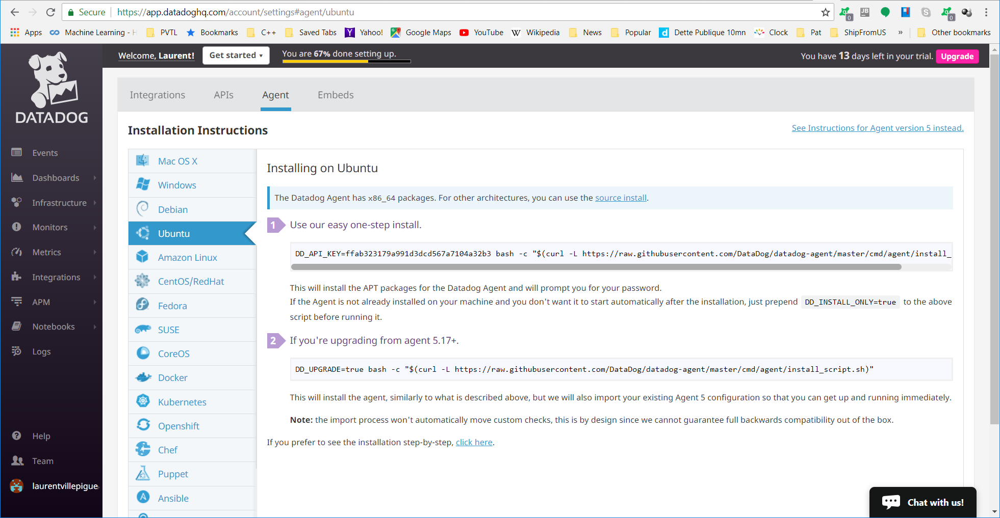

Your answers to the questions go here.


## Installing DataDog for your environment
Let's say you are running a MySQL server on an Ubuntu server you would like to monitor

### 1. Prerequisites - Setup the environment




To edit the agent configuration file
sudo -u dd-agent vi /etc/datadog-agent/datadog.yaml


### 2. Collecting Metrics


[datadog.yaml](etc/datadog-agent/datadog.yaml)


Host map with tags


Installation of a MySQL database on Ubuntu:
```
sudo apt install mysql-server
```

The instructions the links below show how to 

- create a datadog MySQL user and password
- enable replicate


https://docs.datadoghq.com/integrations/mysql/
or if logged in to the DataDog website
https://app.datadoghq.com/account/settings#integrations/mysql


The integration for MySQL comes with the DataDog agent. We only need to copy the example file
```
/etc/datadog-agent/conf.d/mysql.d
sudo -u dd-agent cp conf.yaml.example conf.yaml
sudo -u dd-agent vi conf.yaml
```

Uncomment the entries in the red rectangles then 
- replace user and password with the relevant entries
- use tags relevant to the MySQL server. Here hrdatabase1 and plant6
- set options
    - set replication to 0
    - set galera_cluster to 1


#### Create a custom agent check

An agent check can be written in Python. Documentation is [here](https://docs.datadoghq.com/developers/agent_checks/).
It is a class with a check method with a parameter of type AgentCheck. the AgentCheck package needs to be imported. 
Please find source of the [my_metric_check.py](etc/datadog-agent/checks.d/my_metric_check.py) file below
```
from checks import AgentCheck
import random
class HelloCheck(AgentCheck):
    def check(self, instance):
        self.gauge('my_metric', random.randint(0,1001))
```
For the DataDog agent to find it a corresponding .yaml file with the same name ([my_metric_check.yaml](etc/datadog-agent/conf.d/my_metric_check.yaml)) need to be written in the /etc/datadog-agent/conf.d folder. The *min_collection_interval* parameter for the instance determines how often the check python file is called by the DataDog agent so there is no need to modify the Python check file (answer to the bonus question).
```
init_config:

instances:
    - url: http://localhost
      min_collection_interval: 45
```

Restart the DataDog agent so it reads the new *my_metric_check.yaml* file
```
sudo systemctl restart datadog-agent
```


### 3. Visualizing Data
#### Create a new Timeboard using the DataDog API
To make calls to the API both an API key and an application Key are required. We so far have an API key. To the find the documentation about creating these keys, we navigate to the DataDog Docs Authentication section and click on the link [Manage your account’s API and application keys] (https://app.datadoghq.com/account/settings#api). As we are using the MySQL database, we use 'mysql' as the App key name


3 steps

1. install the Python DataDog API from the command line 
```pip install datadog```

2. write the [create_timeboard.py](scripts/create_timeboard.py) script

3. run the script ```python create_timeboard.py```


**Set the Timeboard's timeframe to the past 5 minutes**:
Use the Keyboard Shortcuts shown when clicking on the keyboard icon on the top-right corner of the timeboard : ```alt + [ / alt + ]: Zoom out/in time frame```


**Take a snapshot of this graph and use the @ notation to send it to yourself**
1. Click on the snapshot button on the graph

2. Write an optional message and the email address to which to send the snapshot prefixed by '@'

3. Below is the email with the snapshot


**Answer to the Bonus Question**: The anomaly graph shows the same shape of line graph as without the anomaly with difference that the line is drawn in a different colour where metric values are outside of the enveloppe upper and lower bounds calculated by the algorithm (the 'basic' algorithm is used here) 


### 4. Monitoring Data

To create a metric monitor on my_metric we follow documentation on

https://docs.datadoghq.com/monitors/monitor_types/metric/
https://docs.datadoghq.com/monitors/notifications/


Email notification from monitor


To schedule downtimes for the monitor read this [documentation](https://docs.datadoghq.com/monitors/downtimes/)


We need to create 3 weekly downtime entries
- Weekly Saturday-Sunday Midnight to Midnight
- Weekly Monday to Friday from 00:00 for 9 hours
- Weekly Monday to Friday from 19:00 for 5 hours


Notifications will be suspended from 7m to 9am daily on M-F No notifications will be sent on weekends @laurentvillepigue@yahoo.com


Select the *Monitors/Manage Downtime* menu


Click the *Schedule Downtime* button


In the *Schedule Downtime* form
- select the monitor: my_metric
- select Recurring
- every 1 week
- Monday to Friday
- Beginning 9:00, endP
curl "https://api.datadoghq.com/api/v1/dash?api_key=ffab323179a991d3dcd567a7104a32b3&application_key=f4ac87aacccf4a2989e9b32addafce1021b75ce1"


**Answer to the Bonus Question**: Difference between service and resource
- A service is a set of processes that do the same job
- A Resource is a particular action for a service. Ex: URL for web app, a query for a database

### 5. Collecting APM Data
First we install python, pip the python package manager, the Flask webserver then ddtrace from DataDog with the following commands respectively

- ```sudo apt install python```
- ```sudo apt install python-pip```
- ```pip install flask```
- ```pip install ddtrace```

There is no need to modify flask_webapp.py as the ddtrace-run command instruments it to send Flask data to the agent. We run the command that instruments our Flask app to report stats to DataDog.

```ddtrace-run python flask_webapp.py```


As shown in the python source code the web server is accessible through port 5050. If the server is running in a container such as Docker or Vagrant then port forwarding needs to be added to the container for it to be accessed from the host or another container.
In this case Vagrant on Windows 10, we add this line in *VagrantFile*
```config.vm.network "forwarded_port", guest: 5050, host: 5050, host_ip: "127.0.0.1"```

Then in a browser on the host we enter these URLs
- http://localhost:5050/
- http://localhost:5050/api/apm
- http://localhost:5050/api/trace


The Flask web app instrumented by ddtrace-run sends traces for each URL used

Link and a screenshot of a Dashboard with both APM and Infrastructure Metrics:
We can have already a dashboard with plenty of infrastructure metrics by selecting menu Infrastructure/Infrastructure List and clicking on the  *ubuntu-bionic* link


1. Drag the *Timeseries* icon to the chart placeholder in the Dashboard
2. Choose the *trace.flask.requests.hits* metric
3. Click *Save*


The new timeseries chart for the metric is shown below in the red rectangle


### 6. Final Question
DataDog can be used for these purposes other than monitoring computer systems or applications: 
- Medical monitor a group of patients that are at home but not in a hospital. Hospitals may require eliminating dependencies on Internet connections that can fail. However for patients outside of the hospital the data collection already depends on an Internet connection.
- Car fleet monitor. Average of the status of each car: engine, brakes, etc, exceeding speed limits. The average status of each car can indicate where to spend budgets to maintain cars and car usage such as speed limit excesses can help defining premiums for insurance.
- Telemetry from any sensors


### 7. Issues encountered
[Issues encountered](issues.md)